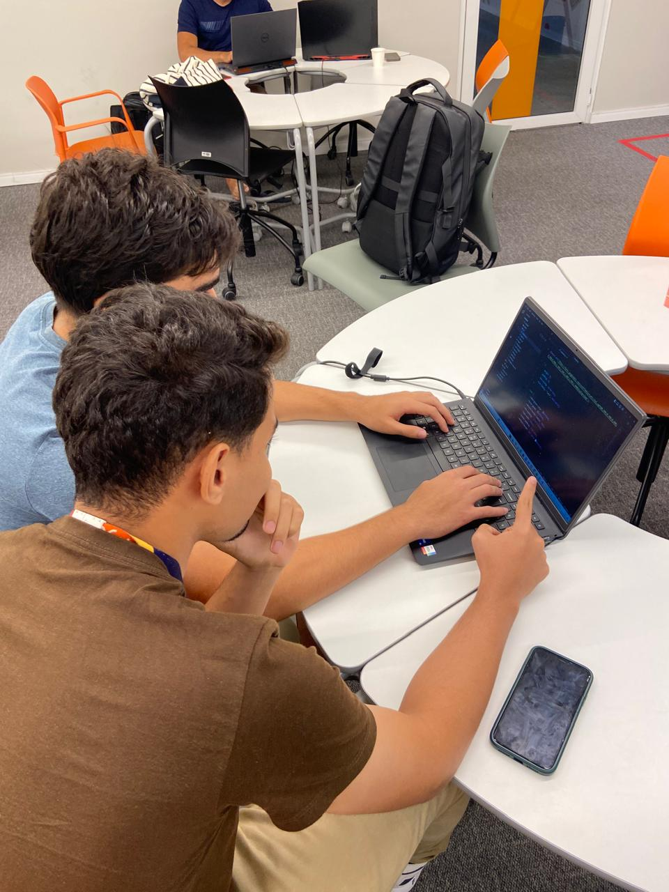

# 🏗️ EcoBuild

**EcoBuild** é uma plataforma web desenvolvida para facilitar a troca, venda ou doação de materiais de construção. Inspirada no modelo de marketplaces como a OLX, a **EcoBuild** oferece um espaço dedicado exclusivamente para itens de construção, ajudando a reduzir o desperdício e promover a sustentabilidade no setor.

## 🌴 ODS

- ODS 9: Indústria, inovação e infraestrutura.
- ODS 11: Cidade e comunidade sustentável.
- ODS 12: Consumo e produção responsáveis.

## 🎯 Objetivo

- Desenvolver uma plataforma que permita a reutilização de materiais de construção, promovendo a sustentabilidade.
- Reduzir o desperdício de materiais e os custos de construção para os usuários.

## 🚀 Funcionalidades

- **👤 Cadastro e Login de Usuários**  
  Crie uma conta para acessar todas as funcionalidades da plataforma.

- **🏷️ Anúncio de Materiais**  
  Anuncie materiais de construção que deseja vender, trocar ou doar.

- **📦 Catálogo de Materiais**  
  Explore uma ampla variedade de materiais disponíveis para compra, troca ou doação. Inclui busca avançada e filtros por categoria, localização, entre outros.

- **💬 Chat Integrado**  
  Converse diretamente com outros usuários para negociar os materiais.

- **⭐ Sistema de Feedback**  
  Avalie as transações e ajude a construir uma comunidade confiável.

- **♻️ Calculadora de Impacto Ambiental**  
  Estime o impacto positivo ao reutilizar ou reciclar materiais de construção.

- **📚 Tutoriais e Dicas**  
  Acesse guias e tutoriais sobre como usar a plataforma e práticas de construção sustentável.

## 👥 Histórias do Usuário

## 🖌️ Protótipo Lo-Fi

[🔗 Link para o Figma](https://www.figma.com/design/D0bygnRLEdzC9fc3lOx9w3/Untitled?node-id=1-2&t=UKStnUdpo9uVuB6L-1)

## 🗂️ Quadro de Atividades no Trello

Acompanhe o progresso do projeto no nosso quadro de atividades do Trello:

[🔗 Link para o Trello - EcoBuild Quadro de Atividades](https://trello.com/invite/b/66ce9a537342df7bbc243bc0/ATTI2c21b7bd0577e32d9082624d67db9e7f0C790E21/ecobuild-quadro-de-atividades)

## 👷 Diagrama de Atividades
[🔗 Link para o Diagrama de Atividades](https://lucid.app/lucidchart/5e772447-e51c-463a-8f76-ef1908555f2e/edit?viewport_loc=-97%2C1%2C3000%2C1387%2C0_0&invitationId=inv_f78084c2-6c8a-4d69-b94f-c26ff5e2c948)

## Programação em Par

## 🛠️ Tecnologias Utilizadas

### Frontend

- **Javascript ou React.js**
- **HTML5**
- **CSS3**

### Backend

- **Django**

### Banco de Dados

- **MySQL**
